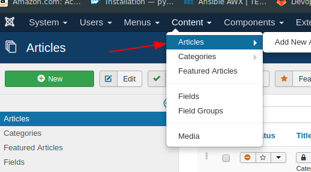
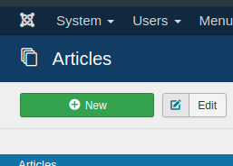
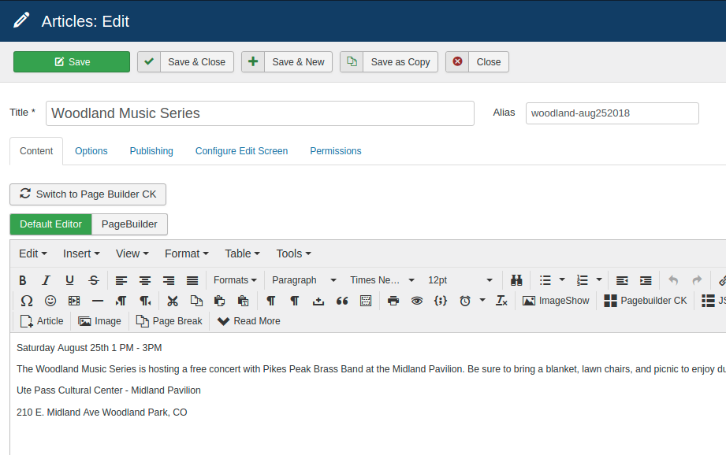
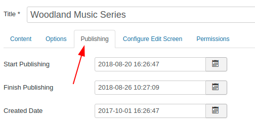
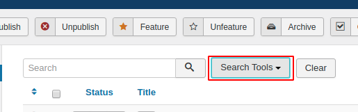
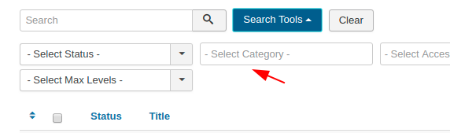
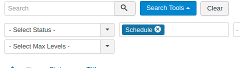
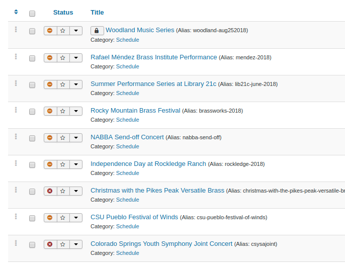

# Adding an event

- Login to the admin portal [here](http://pikespeakbrassband.com/administrator/)

In the top menu, click on Content -> Articles



In the top left, Click  `+New`



Fill out the form as follows:

- Title: `Name of the Event`
- Alias: `Short name with no spaces`
- Body:

```
Date and time
description
Location
```



Next click on `Publishing`



The important sections are the `Start Publishing` and `Finish Publishing`

- Start Publishing: The date and time when the event will appear on the webpage. You can usually set this to the current date.
- Finish Publishing: The date when the even will remove itself from the website. I usually set this for the day after the event.

Once finished, you can click `Save & Close`

Then click `Search Tools`



In the Select Category Box, click `Schedule`





This will then filter the articles for only events.



The events page will display in reverse order from this list as shown
