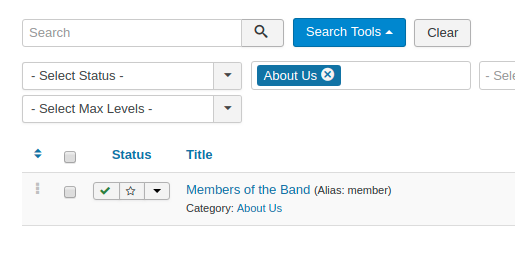
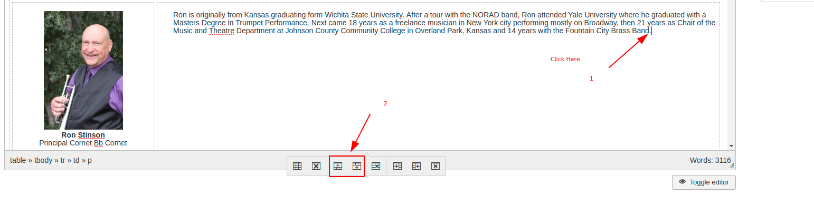
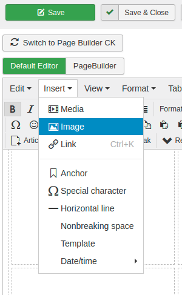

# Edit the Member Roster

- Login to the admin portal [here](http://pikespeakbrassband.com/administrator/)

In the top menu, click on Content -> Articles

click `Search Tools`

In the Select Category Box, click `About Us`

Then click `Members of the Band`

The members of the band page is structures as one large table.  To insert a row in the table for a new member you can click on an adjacent row then the insert row above or below

Once the row is there you can Insert the image from the `Insert` -> `Image`

Type in the information then click `Save`
